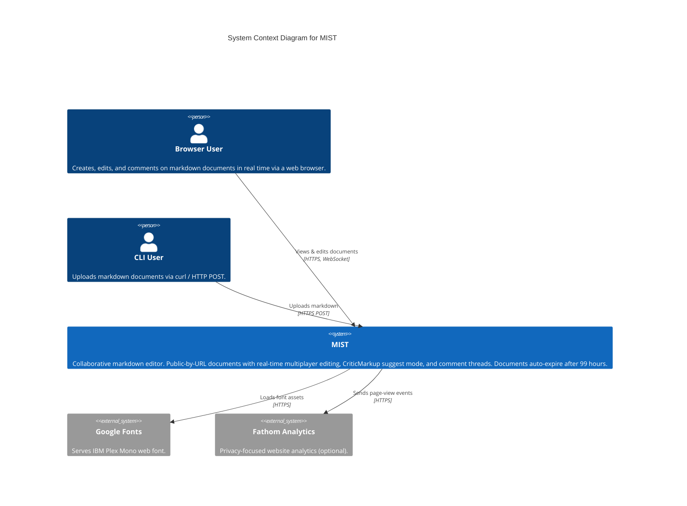
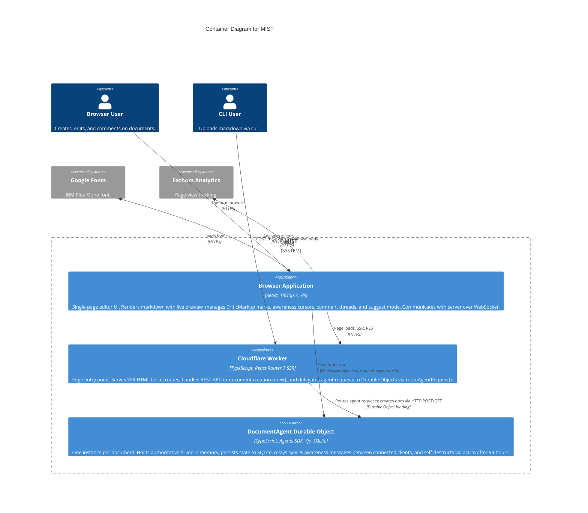
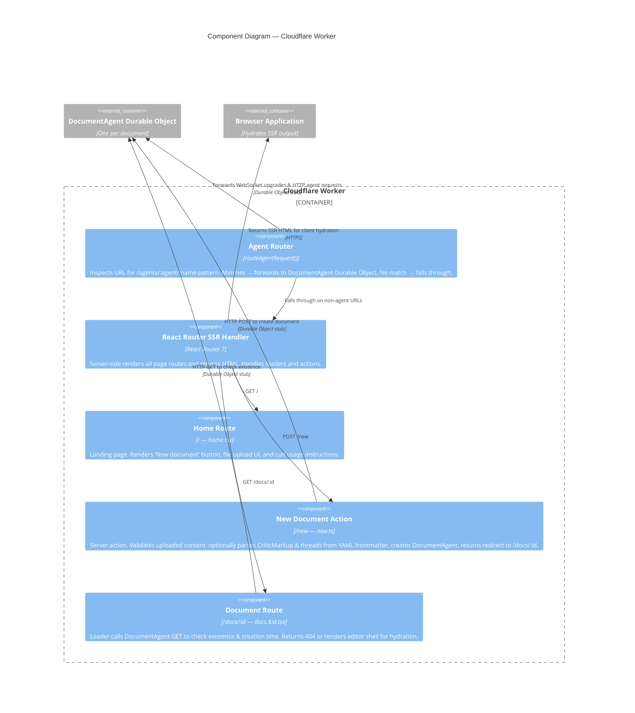
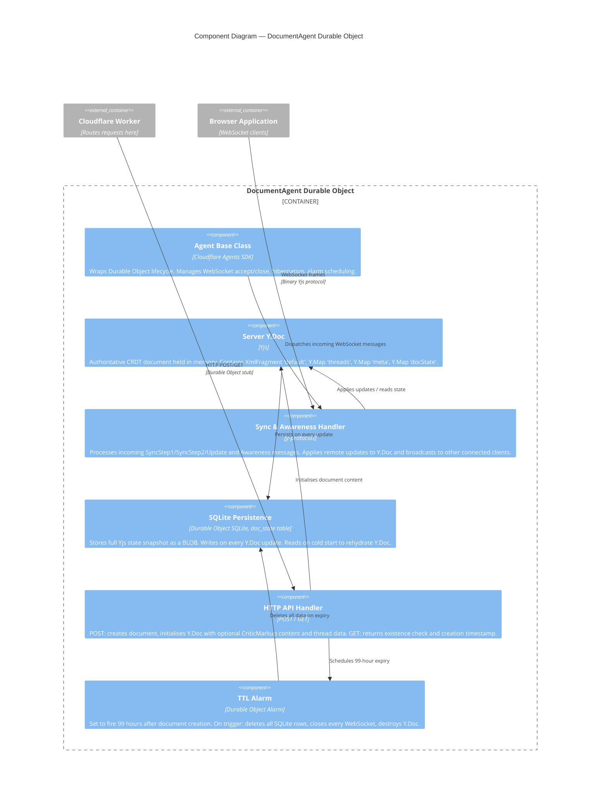
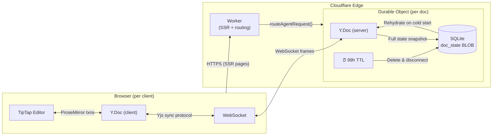

# MIST — C4 Architecture Diagrams

These diagrams follow the [C4 model](https://c4model.com/) to describe the architecture of MIST, a collaborative markdown editor (think GitHub Gist × Google Docs). Documents are public-by-URL, auto-expire after 99 hours, and support real-time multiplayer editing with CriticMarkup suggest mode and comment threads.

Three levels are provided:

1. **System Context** — MIST and its external actors/systems
2. **Container** — The major runtime deployment units
3. **Component** — Internal structure of each container

Diagrams use Mermaid's built-in C4 diagram types (`C4Context`, `C4Container`, `C4Component`).

---

## Level 1 — System Context

Shows MIST as a single box, the people who use it, and the external systems it touches.



---

## Level 2 — Container

Zooms into MIST to show its major runtime containers: the browser SPA, the Cloudflare Worker, and the Durable Object instances.



---

## Level 3 — Component Diagrams

### 3a — Cloudflare Worker Components

Internal structure of the Worker entry point (`workers/app.ts`).



### 3b — DocumentAgent Durable Object Components

Internal structure of a single DocumentAgent instance (`agents/document.ts`).



### 3c — Browser Application Components

Internal structure of the client-side SPA.

```mermaid
C4Component
  title Component Diagram — Browser Application

  Container_Boundary(spa, "Browser Application") {
    Component(docProvider, "DocumentProvider", "React Context", "Top-level context wrapping the editor page. Manages shared state: mode (edit/suggest), preview toggle, clean view, active comment, thread list.")
    Component(yjsHook, "useYjsEditor Hook", "Yjs, useAgent()", "Creates client-side Y.Doc and Awareness. Opens WebSocket to /agents/document-agent/:docId via useAgent from agents/react.")
    Component(yjsProvider, "YjsProvider", "y-protocols, WebSocket", "Bridges WebSocket ↔ Yjs. Sends SyncStep1 on connect, relays sync/awareness messages in both directions, forwards local doc updates.")
    Component(editor, "TipTap Editor", "TipTap 3, ProseMirror", "Rich-text markdown editor with Collaboration and CollaborationCaret extensions bound to the shared Y.Doc XmlFragment.")
    Component(criticMarks, "CriticMarkup Marks", "TipTap Extensions", "CriticAddition, CriticDeletion, CriticComment, CriticHighlight marks. CriticDelimiters renders {++ ++} / {-- --} etc. as ProseMirror decorations.")
    Component(suggestMode, "SuggestMode Plugin", "ProseMirror Plugin", "When mode='suggest', intercepts text input and backspace keystrokes to produce addition/deletion marks instead of direct document edits.")
    Component(mdDecorations, "MarkdownDecorations", "ProseMirror Plugin, sugar-high", "Syntax highlighting decorations for markdown constructs: bold, italic, code, headings, links, code blocks with sugar-high tokenizer.")
    Component(threads, "Thread System", "useThreads hook, Y.Map 'threads'", "Observes Y.Map changes and editor selection. Auto-creates thread entries for unmatched comment marks. Provides add-reply, resolve, delete operations.")
    Component(preview, "Preview Panel", "marked", "Renders the current document as HTML from markdown. Toggled via PreviewToggle.")
    Component(toolbar, "Toolbar & Controls", "React Components", "ModeToggle, ShareButton, ThemeSelector, CleanViewToggle, PreviewToggle, ConnectionStatus indicator.")
    Component(threadUI, "Thread UI", "React Components", "ThreadPanel, ThreadList, CommentInput, SuggestionActions, ActiveCommentHighlight. Sidebar for viewing and managing comment threads.")
  }

  Container_Ext(docAgent, "DocumentAgent", "WebSocket endpoint")
  System_Ext(googleFonts, "Google Fonts", "IBM Plex Mono")
  System_Ext(fathom, "Fathom Analytics", "Page views")

  Rel(yjsHook, yjsProvider, "Passes Y.Doc + WebSocket")
  Rel(yjsProvider, docAgent, "Sync & awareness messages", "WebSocket")
  Rel(yjsHook, editor, "Binds Y.Doc XmlFragment to TipTap")
  Rel(editor, criticMarks, "Registers CriticMarkup mark types")
  Rel(editor, suggestMode, "Registers ProseMirror plugin")
  Rel(editor, mdDecorations, "Registers decoration plugin")
  Rel(docProvider, editor, "Provides mode, state")
  Rel(docProvider, threads, "Provides thread state")
  Rel(threads, threadUI, "Thread data & operations")
  Rel(docProvider, toolbar, "State & toggles")
  Rel(editor, preview, "Document content for rendering")
  Rel(spa, googleFonts, "Loads font", "HTTPS")
  Rel(spa, fathom, "Analytics", "HTTPS")

  UpdateLayoutConfig($c4ShapeInRow="4", $c4BoundaryInRow="1")
```

---

## Data Flow Summary


